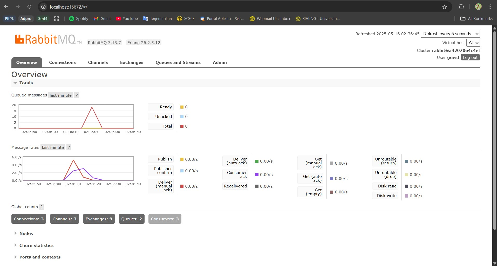
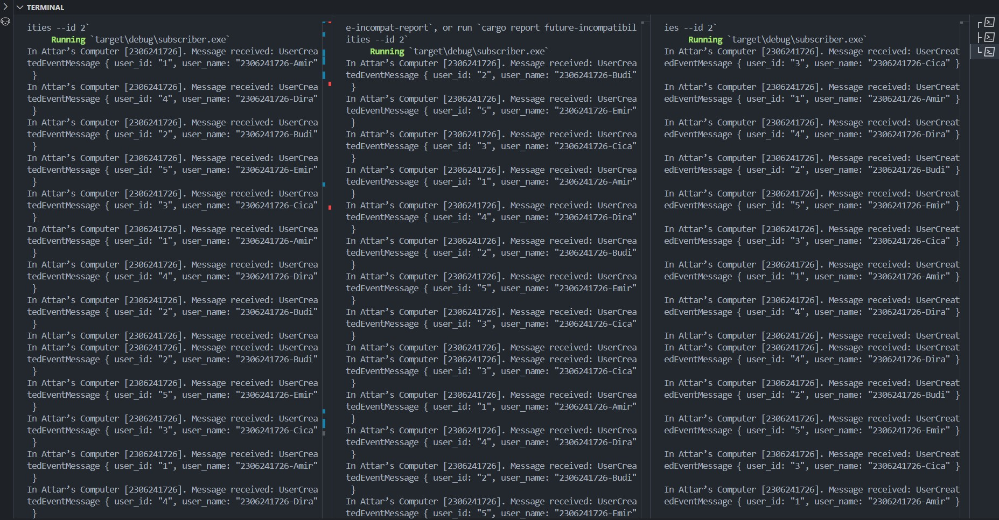
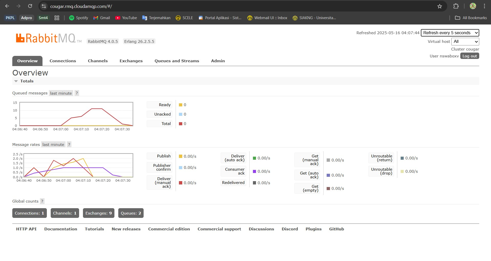

    <h1>MODULE 9</h1>

    

    <h2>Alwie Attar Elfandra</h2>
    <h2>2306241726</h2>

# 1. What is `amqp`?

**AMQP (Advanced Message Queuing Protocol)** adalah protokol komunikasi yang distandardisasi dan dirancang untuk pertukaran pesan antar aplikasi. AMQP memungkinkan sistem perangkat lunak yang berbeda—terutama yang berjalan secara terdistribusi atau di cloud—untuk saling berkomunikasi dengan cara yang andal, aman, dan efisien.

Dalam konteks pemrograman, seperti pada kode `main.rs`, AMQP digunakan sebagai sarana untuk terhubung dengan sistem antrean pesan (message queue) seperti **RabbitMQ**. Sistem ini memungkinkan satu bagian aplikasi untuk mengirim pesan ke antrean, dan bagian lainnya untuk membaca serta memproses pesan tersebut secara **asinkron**.

Sebagai contoh, antrean dengan nama `"user_created"` dapat digunakan untuk menerima notifikasi bahwa seorang pengguna baru telah dibuat. Handler seperti `UserCreatedHandler` kemudian akan menangani pesan tersebut begitu diterima.

# 2. What does it mean? guest:guest@localhost:5672 , what is the first guest, and what is the second guest, and what is localhost:5672 is for?

Format `guest:guest@localhost:5672` merupakan bagian dari **URL koneksi** ke server RabbitMQ, yang menjelaskan bagaimana aplikasi akan terhubung. Berikut adalah penjabaran dari masing-masing komponennya:

* **`guest:guest`**: Ini adalah kombinasi **username** dan **password** yang digunakan untuk autentikasi. Dalam contoh ini, baik nama pengguna maupun kata sandi adalah `"guest"`, yang merupakan kredensial default RabbitMQ. Untuk alasan keamanan, penggunaan akun default ini **tidak disarankan di lingkungan produksi**.

* **`localhost`**: Ini menunjukkan bahwa koneksi dilakukan ke server RabbitMQ yang berjalan di **komputer lokal** (yaitu mesin tempat aplikasi dijalankan).

* **`5672`**: Ini adalah **port default** yang digunakan oleh RabbitMQ untuk menerima koneksi berbasis AMQP.

Secara keseluruhan, `guest:guest@localhost:5672` berarti: terhubung ke server RabbitMQ lokal yang berjalan di port 5672, menggunakan kredensial default "guest" sebagai username dan password.

# Simulation slow subscriber

    

Queued messages pada message broker akan bertambah karena adanya delay yang diberikan, sehingga publisher lebih cepat mengirim dibandingkan subscriber yang menerima. Pada kasus saya, banyaknya queued messages pada message broker paling banyak menyentuh 21 untuk 6 kali melakukan run Publisher.

# Reflection and Running at least three subscribers

    

    

Dapat dilihat kalau pada tiap subscriber mendapatkan data yang berbeda-beda saat publisher mengirimkan banyak data ke message queue. Ini karena tiap subscriber berfungsi seperti aplikasi nya masing-masing sehingga terpisah saat mengambil data dari message queue. Ketika data sudah terambil dari message queue, maka message akan hilang dan aplikasi lain tidak bisa menggunakannya.

Tanpa mengubah kode dari program, kita bisa memperoleh hasil yang berbeda dengan mengubah konfigurasi message broker atau jumlah dari subscriber yang berjalan. Inilah yang disebut dengan event driven.

# Simulation slow subscriber

    

Queued messages pada message broker akan bertambah karena adanya delay yang diberikan, sehingga publisher lebih cepat mengirim dibandingkan subscriber yang menerima. Pada kasus saya, banyaknya queued messages pada message broker paling banyak menyentuh 11 untuk 6 kali melakukan run Publisher.